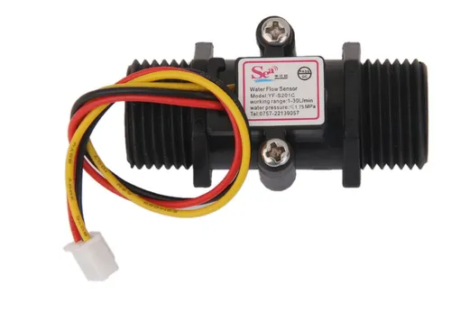
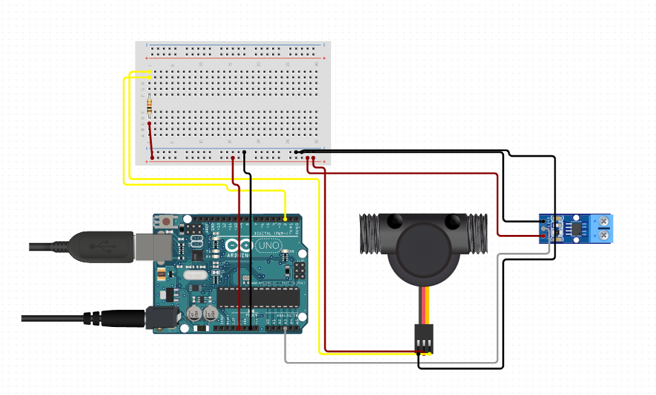

# Documentação
A ideia principal dessa implementação é controlar tanto o gasto de energia como o de consumo de água de uma máquina de lava roupa compartilhada.
A instalação desse projeto seria útil por exemplo, na república onde moro, onde algumas features extras poderiam ser projetadas baseadas no circuito sugerido abaixo.
Como:
* Lembrete via e-mail para retirar a roupa da máquina
* Reserva de horário, onde a máquina só seria acessada por um token válido

## Componentes Utilizados
### Sensor De Fluxo De Água | R$ 40

### Sensor de corrente | Preço Médio: R$ 25

### Arduino Uno | Preço Médio: R$72

## Implementação do Circuito
- 

Os módulos mais importantes para controlar o fluxo de energia e água, são o Rele e a válvula solenoide, com eles é possível realizar cálculos sobre o valor em reais que somente a máquina representou na soma das contas finais do mês.

É importante resaltar o rele e válvula escolhidos para realizar esse monitoramente, o [sensor de vazão](https://produto.mercadolivre.com.br/MLB-1614904261-sensor-de-fluxo-vazo-de-agua-yf-s201-arduino-_JM?matt_tool=87716990&matt_word=&matt_source=google&matt_campaign_id=12413740998&matt_ad_group_id=119070072438&matt_match_type=&matt_network=g&matt_device=c&matt_creative=500702333978&matt_keyword=&matt_ad_position=&matt_ad_type=pla&matt_merchant_id=244393755&matt_product_id=MLB1614904261&matt_product_partition_id=337120033364&matt_target_id=pla-337120033364&gclid=Cj0KCQjwv5uKBhD6ARIsAGv9a-xDBRNt_qhN18Q2n2y3zwrj--qc7V7aJAUfBRaVt-7ifHk0TWf68iMaAg6mEALw_wcB), fornece pulsor elétricos de acordo com o fluxo de água. Sendo possível realizar o cálculo do fluxo:

$f/K$

f = frequência dos pulsos

K = 7.5 (Fluxo em litros/min)

E o rele será utilizado para calcular o gasto de energia em Watts em tempo real, utilizando a fórmula

$P = V.I$

E multiplicar a potência encontrada pelo custo de Watts médio cobrado.

**OBS**: É importante para diminuir o ruído da medição seguir algumas instruçoes importantes contidas no datasheet do aparalho como:

### Informações importantes do sensor

Primeiramente devemos saber algumas informações importantes do sensor. A saída do sensor é **(1023)[Vcc](https://www.quora.com/What-is-VCC-voltage)/2** para corrente = 0. Cada sensor tem uma sensibilidade de tenção por amper, no [datasheat](https://www.sparkfun.com/datasheets/BreakoutBoards/0712.pdf) é possível encontrar esses dados, mas para facilitar, o sensor de **30A é 66mV/A** o de **20A é 100mV/A** e o de **5A é 185mV/A.**

Para calcularmos a corrente do sensor devemos ajustar o valor lido para Volts. Como trabalhamos na escala de **0-1023** no arduino e trabalhamos na faixa dos **5V**, vamos retirar a tenção por unidade fazendo **5/1023** que é igual a: **0.004887586**.

Agora nossa corrente é calculada da seguinte maneira:

(valorSensor-(Vcc/2)) * tenção_por_unidade / sensibilidade_de_tenção

simplificando:

(valorSensor-(1023/2)) * 0.004887586 / 0.185

O complicado é como capturar o valor do sensor, pois o **analogRead** nos retorna um inteiro e não teremos precisão suficiente com um dado inteiro para pegarmos valores em mA em AC.

## Recursos Importantes

[Sensor de Corrente ACS712: como utilizar, medir corrente DC e AC, potência e energia - Tutorial 22](https://www.youtube.com/watch?v=4GlKsWehGP4&ab_channel=GEProjetoseTutoriais)

[Arduino - O módulo MOSFET](https://www.youtube.com/watch?v=vn7YeFh1xv4&ab_channel=OMundoDaCi%C3%AAncia)