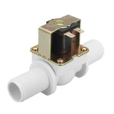
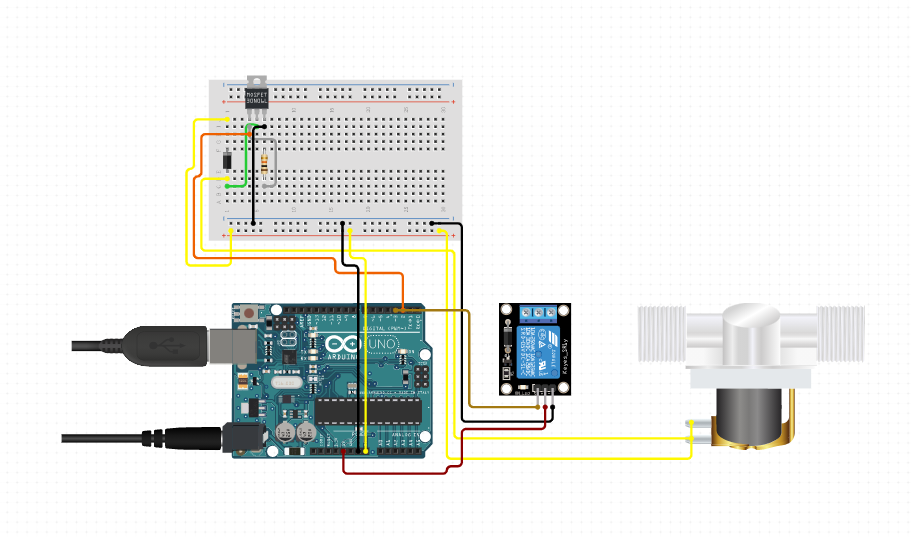

# Documentação
A ideia principal dessa implementação é controlar tanto o gasto de energia como o de consumo de água de uma máquina de lava roupa compartilhada.
A instalação desse projeto seria útil por exemplo, na república onde moro, onde algumas features extras poderiam ser projetadas baseadas no circuito sugerido abaixo.
Como:
* Lembrete via e-mail para retirar a roupa da máquina
* Reserva de horário, onde a máquina só seria acessada por um token válido

## Componentes Utilizados
### Válvula Solenoide 3/4 | Preço Médio: R$ 61

### Módulo Rele | Preço Médio: R$ 11

### Arduino Uno | Preço Médio: R$72

## Implementação do Circuito
- 

## Recursos Importantes

[Sensor de Corrente ACS712: como utilizar, medir corrente DC e AC, potência e energia - Tutorial 22](https://www.youtube.com/watch?v=4GlKsWehGP4&ab_channel=GEProjetoseTutoriais)

[Arduino - O módulo MOSFET](https://www.youtube.com/watch?v=vn7YeFh1xv4&ab_channel=OMundoDaCi%C3%AAncia)